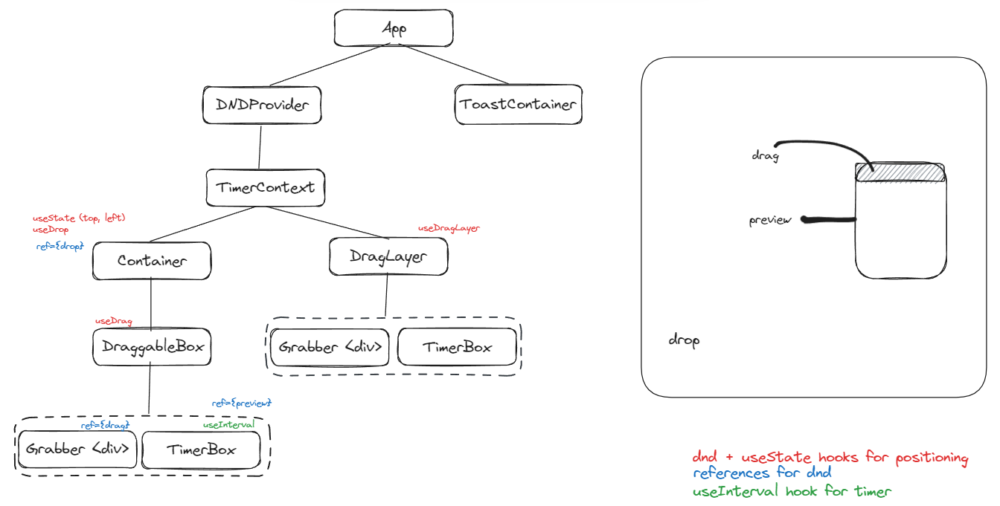

## To Run
- clone this repo
```
npm i
npm start
```

## App Structure



## Project Steps

### 1. Install dependencies
```
npx create-react-app steam-clock-redo --template typescript
npm install react-dnd react-dnd-html5-backend
npm install usehooks-ts
npm install react-toastify
npm install -D tailwindcss
npx tailwindcss init
```
### 2. Setup tailwind
- https://tailwindcss.com/docs/guides/create-react-app
- import css file into the corresponding components

### 3. Import fonts
- copy and paste the font file
- add to App.css

### 4. Create Context Provider At topmost level

### 5. Create Timer Component
- Components
    - ControlBtn
    - TimeBtn
    - StartBtn
- Combined into TimerBox

### 6. Add css to components

### 7. Create Drag And Drop Context at topmost level

### 8. Create drag and drop components with react-dnd hooks
- DraggableBox: useDrag
- Container: useDrop
- CustomDragLayer: useDragLayer

### 9. Add Toast container

### 10. Add Sound
